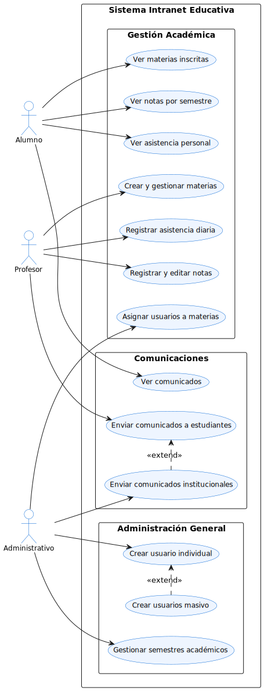
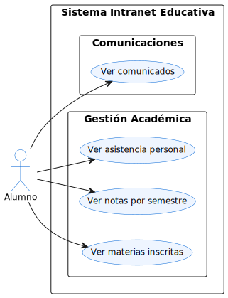
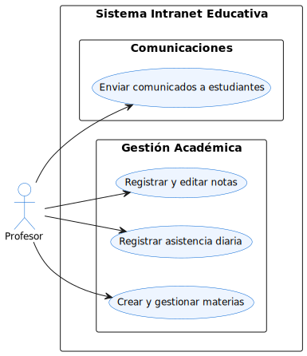
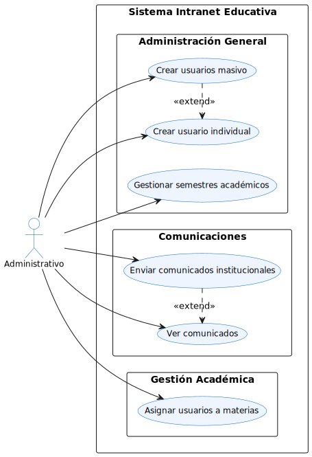
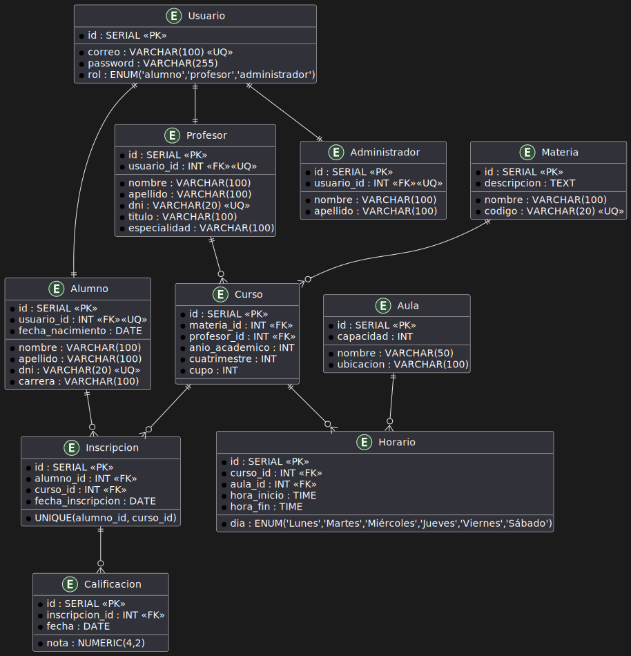

# 📂 Diagramas de la Intranet

Esta carpeta contiene todos los diagramas utilizados para documentar el sistema de Intranet Educativa.

## Diagramas Disponibles

* 🗺️ **casos\_uso\_general**

  * Diagrama general de casos de uso, agrupado por módulos funcionales.
  * 

* 👨‍🎓 **casos\_uso\_alumno**

  * Casos de uso específicos para el rol Alumno.
  * 

* 👨‍🏫 **casos\_uso\_profesor**

  * Casos de uso específicos para el rol Profesor.
  * 

* 👩‍💼 **casos\_uso\_administrativo**

  * Casos de uso específicos para el rol Administrativo, con relaciones de extensión.
  * 

* 🗃️ **modelo\_datos**

  * Modelo entidad-relación en español con claves primarias, foráneas y restricciones.
  * 

---