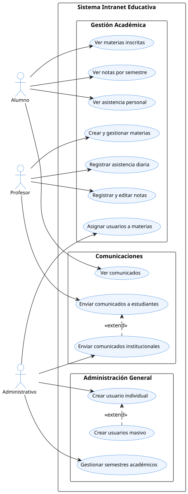
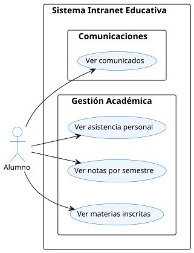
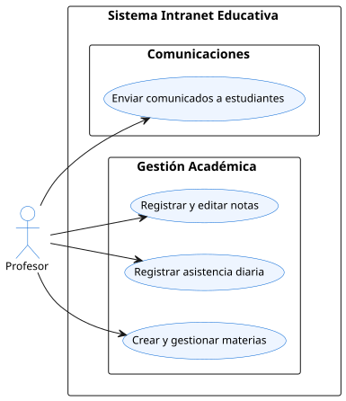
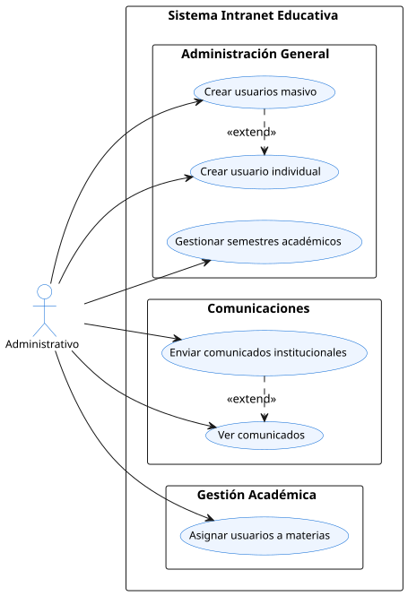
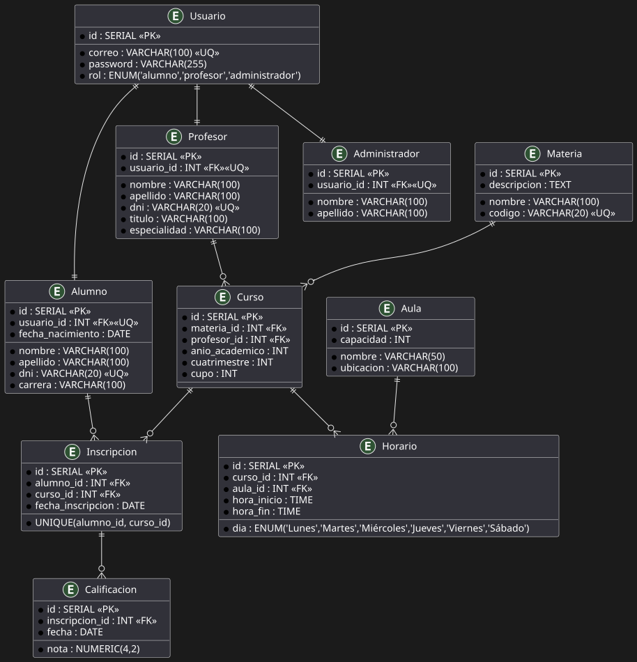

# 📂 Diagramas de la Intranet Educativa

Esta carpeta agrupa los diagramas de análisis funcional y de diseño de datos del proyecto.

## 🗺️ Casos de uso

### 1. General del sistema

- **Archivo:** [`casos_uso_general.svg`](casos_uso_general.svg)
- **Descripción:** visión global de los módulos y las principales interacciones.

### 2. Rol Alumno

- **Archivo:** [`casos_uso_alumno.svg`](casos_uso_alumno.svg)
- **Descripción:** funcionalidades disponibles para el perfil de alumno.

### 3. Rol Profesor

- **Archivo:** [`casos_uso_profesor.svg`](casos_uso_profesor.svg)
- **Descripción:** actividades académicas y de seguimiento por docente.

### 4. Rol Administrativo

- **Archivo:** [`casos_uso_administrativo.svg`](casos_uso_administrativo.svg)
- **Descripción:** gestión operativa y administrativa del sistema.

## 🗃️ Modelo y estructura de datos

### 5. Modelo de datos (ER) — original

- **Archivo:** [`modelo_datos.svg`](modelo_datos.svg)
- **Descripción:** entidades, relaciones y restricciones principales.

### 6. Diagrama base de datos — original

- **Archivo:** [`diagrama base de datos.svg`](diagrama%20base%20de%20datos.svg)
- **Descripción:** estructura relacional de tablas y vínculos.

### 7. Schema actual con problemas identificados

- **Archivo:** [`modelo_datos_actual.md`](modelo_datos_actual.md)
- **Descripción:** diagrama Mermaid del estado actual de la BD con los problemas de diseño anotados (FK faltantes, tabla huérfana, `cuatrimestre` hardcodeado, ausencia de `asistencia`).

### 8. Schema modular propuesto (multi-establecimiento)

- **Archivo:** [`modelo_datos_modular.md`](modelo_datos_modular.md)
- **Descripción:** diseño objetivo que soporta colegio, liceo, liceo técnico-profesional, CFT, instituto profesional y universidad en una misma instancia. Incluye `Establecimiento`, `PeriodoAcademico`, `PlanDeEstudio`, `PlanMaterias` y `Asistencia`, con tabla de compatibilidad por tipo de institución.

## 🧪 Uso recomendado durante desarrollo

- Antes de modificar modelos Sequelize (`backend/src/models`), revisa los diagramas de datos.
- Antes de agregar flujos de negocio o pantallas, revisa casos de uso por rol.
- Si cambian reglas de negocio, actualiza primero requerimientos y luego el diagrama relacionado.
